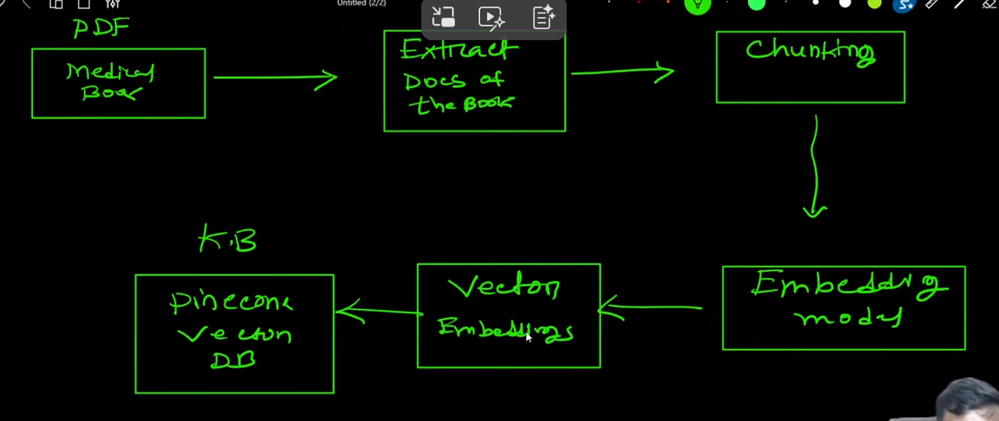
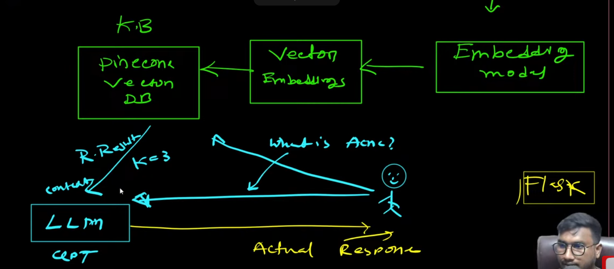
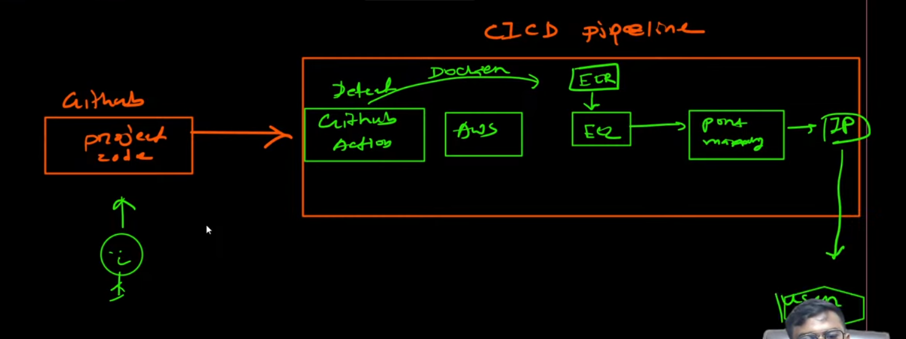

# Medical_Chatbot
## Challenges
- You need lots of data for fine tunning the model
- Require high computational resource power - High Grphics Card (GPU)
- High Cost is involved

## Process Flow of Medical Chatbot (This Flow is known as RAG)
- Input Book or Content PDF
- Extract the contents or text from the pdf
- Apply chunkings to split the entire pdf contents to small piece because open ai has capability to consider max 8192 tokens at a time/together
- Apply embedding model/techniques to convert chunks to vector
- Store these vector embeddings to vector database(PineCone) (Also called as knowlege base)
- Similarity search can be applied to these vector db to find similar context based on score
- We will be using open ai provider to access gpt models, groq provider provides free llm model, open router provides free llm model.
- User will raise the query which will hit to knowledge database
- KB will return the ranking based or similar Search results/rank results provide to LLM Model
- Model will take both input : query & vector database response
- Vector Database or Knowledge base is linked to LLM Model, providing the custom data

- Tech Stack
- Python 
- OpenAI GPT
- Langchain (Orchestrating Framework)
- PineCone(Vector Database)
- Flask (Front End Development)
- Deployment(AWS - CICD)

- CICD Pipeline Flow

- Flow that we are going to flow
- 1. Github Reoi
- 2. Project Template
- 3. Project Setup
- 4. Notebook Experiment
- 5. Modular Coding
- 6. Build Web App
- 7. Deployment
